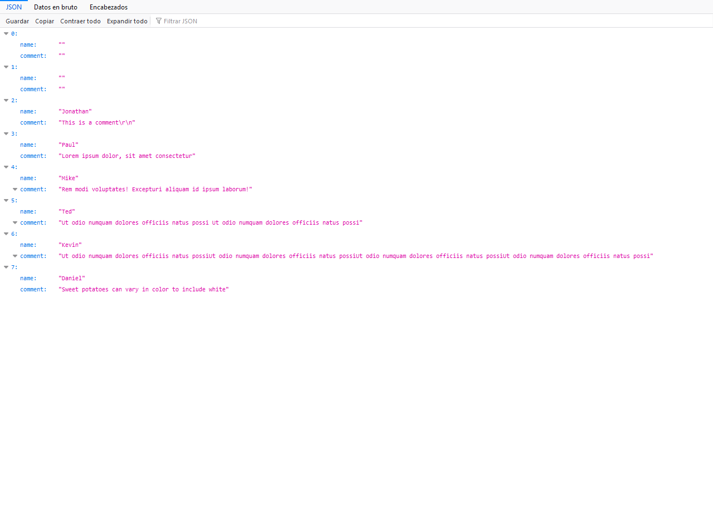

## Node.js-Express-WebSite

This repository contains the code of a small project I did with the idea of improving my skills in the use of node.js and express.

### About the app

The part of the code to be considered is the comments section, which is where this project is concentrated.
This app creates a database called comments.db in which it stores the comments entered in the comments section.

### How to run the App

  1. In your terminal, navigate to the root directory . `.......>cd nodejs-express-website`
  2. Run npm install to install all dependencies. `...\nodejs-express-website>npm install`
  3. Run npm start to start the app. `...\nodejs-express-website>npm start`
  4. If everything works you'll see a message in the terminal `Server is running on port 3000`
  5. Open your favorite browser to the address `http://localhost:3000/`

### How to see the comments in JSON format
  6. Open your favorite browser to the address `http://localhost:3000/comments`
  
## Here are some screenshots
  ### Full view
  
    
  ### Comments.db
  

